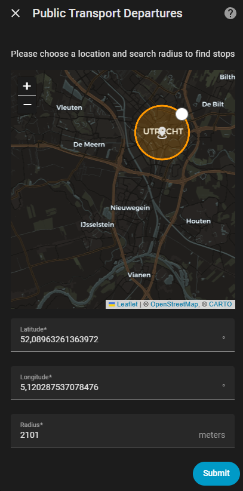
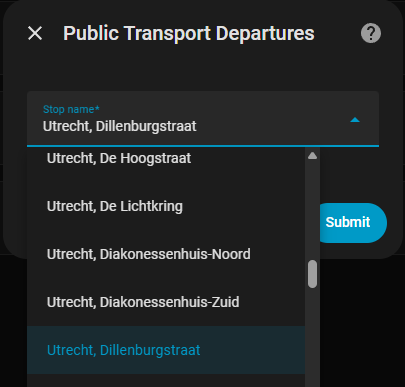
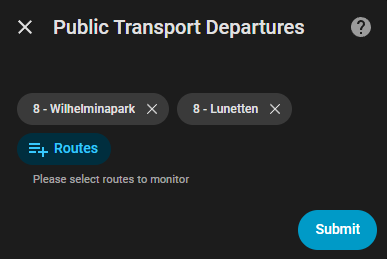
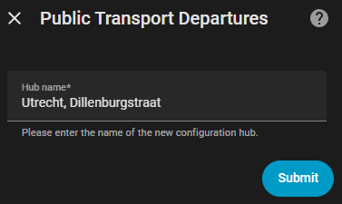
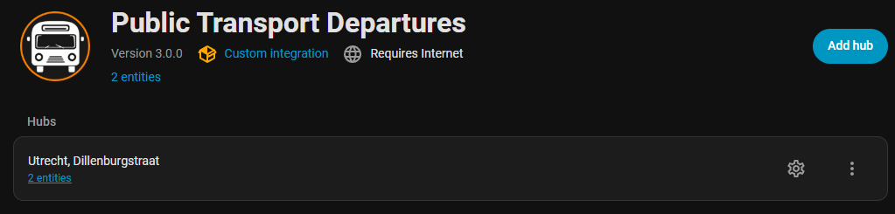
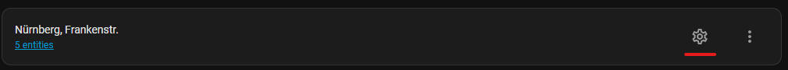

# Public Transport Departures
[](https://github.com/custom-components/hacs)


<p align="center">
  
</p>

This integration provides real-time information on upcoming departures across various public transport modes, including buses, subways, trams, and more.

***

## Data source
The `Public Transport Departures` uses [Transitous](https://transitous.org/) as data source.

## Supported countries
With the latest version (> 3.0.0) of ha-departures, the integration now supports public transport departure information across a wide range of countries worldwide, thanks to the integration of the [Transitous API](https://api.transitous.org/).

Users can access departure data from transit systems in the following regions:

<details>
<summary>Countries</summary>
<ul>
<li>Albania</li>
<li>Australia</li>
<li>Austria</li>
<li>Belgium</li>
<li>Bermuda</li>
<li>Bosnia and Herzegovina</li>
<li>Brazil</li>
<li>Bulgaria</li>
<li>Canada</li>
<li>Chile</li>
<li>Colombia</li>
<li>Croatia</li>
<li>Cyprus</li>
<li>Czechia</li>
<li>Denmark</li>
<li>Egypt</li>
<li>Estonia</li>
<li>Ethiopia</li>
<li>Finland</li>
<li>France</li>
<li>Germany</li>
<li>Greece</li>
<li>Hong Kong</li>
<li>Hungary</li>
<li>Iceland</li>
<li>India</li>
<li>Indonesia</li>
<li>Ireland</li>
<li>Israel</li>
<li>Italy</li>
<li>Japan</li>
<li>Korea</li>
<li>Kosovo</li>
<li>Latvia</li>
<li>Liechtenstein</li>
<li>Lithuania</li>
<li>Luxembourg</li>
<li>Malaysia</li>
<li>Mexico</li>
<li>Moldova</li>
<li>Monaco</li>
<li>Montenegro</li>
<li>Netherlands</li>
<li>New Zealand</li>
<li>North Macedonia</li>
<li>Norway</li>
<li>Oman</li>
<li>Poland</li>
<li>Portugal</li>
<li>Puerto Rico</li>
<li>Romania</li>
<li>Serbia</li>
<li>Singapore</li>
<li>Slovakia</li>
<li>Slovenia</li>
<li>Spain</li>
<li>Sweden</li>
<li>Switzerland</li>
<li>Thailand</li>
<li>Türkiye</li>
<li>Ukraine</li>
<li>United Arab Emirates</li>
<li>United Kingdom</li>
<li>United States</li>
</ul>
</details>

## Installation

### HACS Installation (recommended)

[](https://my.home-assistant.io/redirect/hacs_repository/?owner=alex-jung&repository=ha-departures&category=integration)

### Manual Installation

1. Using the tool of choice open the folder for your HA configuration (where you find `configuration.yaml`).
2. If you do not have a `custom_components` folder there, you need to create it.
3. In the `custom_components` folder create a new folder called `ha_departures`.
4. Download all the files from the `custom_components/ha_departures/` folder in this repository.
5. Place the files you downloaded in the new folder you created in `step 3`.
6. Restart Home Assistant

## Configuration

### Start integration dialog
The configuration of integration is made via Home Assistant GUI
1. Open `Settings` / `Devices & services`
2. Click on `Add Integration` button
3. Search for `Public Transport Departures`
4. Click on integration to start [configuration dialog](#Configure-a-new-station)

### Configure a hub configuration

#### Step 1 - Choose a location and radius to search



#### Step 2 - Choose a stop
> Please select one stop location from the list



#### Step 3 - Choose the connections
> You will get list of connections provided by the API for selected stop.
> Select all connection(s) you are interesting in and click on `Submit`



#### Step 4 - Define a name of new hub configuration
Choose a name for your new hub configuration

> [!WARNING]
> No duplicate names to existing hubs are allowed!



After `Submit` a new `Hub` will be created incl. new sensor(s) for each connection you selected in previous step:



## Reconfigure an entry
You can any time add or remove connections to existing `hub's` (stop locations)



Just click on :gear: icon, select or deselct the connections and click on `Submit`, Integration will add new connections to the integration.
The status of removed connections will be changed to `not provided`.

## Usage in dashboard

### Option 1 (ha-departures-card)


Documentation of this card please s. [repository](https://github.com/alex-jung/ha-departures-card)

### Option 2 (show departure time)
Add a custom template sensor in your _configuration.yaml_
```yaml
sensor:
  - platform: template
    sensors:
      furth_197:
        friendly_name: 'Fürth Hauptbahnhof - Bus 179 - Fürth Süd(time only)'
        value_template: "{{ (as_datetime(states('sensor.furth_hauptbahnhof_bus_179_furth_sud'))).strftime('%H:%m') }}"
```
Add entity (or entites) card to your Dashboars(don't forget to reload yaml before)
```yaml
type: entities
entities:
  - entity: sensor.furth_197
    name: Fürth Hauptbahnhof - Bus 179 - Fürth Süd
    icon: mdi:bus
```


### Option 3 (with time-bar-card)
You can use other cards like [time-bar-card](https://github.com/rianadon/timer-bar-card) to visualize remaining time to the next departure.
card yaml configuration:
```yaml
type: custom:timer-bar-card
name: Abfahrten Fürth-Hbf
invert: true
entities:
  - entity: sensor.furth_hauptbahnhof_u_bahn_u1_furth_hardhohe
    bar_width: 30%
    name: U1 - Hardhöhe
    guess_mode: true
    end_time:
      state: true
  - entity: sensor.furth_hauptbahnhof_bus_179_furth_sud
    bar_width: 30%
    name: 179 - Fürth Süd
    guess_mode: true
    end_time:
      state: true
```
Result looks like there:\


## ☕ Support My Work

If you enjoy my work or find it useful:

[](https://ko-fi.com/alexjungnbg)

---
