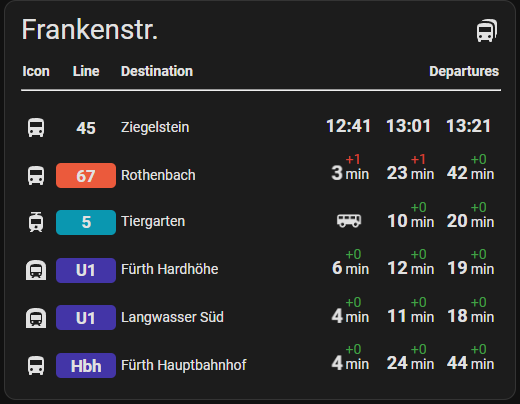

# Departures
[](https://github.com/custom-components/hacs)


<p align="center">
  
</p>

This integration provides information about next departures for different public transport types like Bus, Subway, Tram etc.

***

## API Endpoints
The `Public Transport Departures` integration uses EFA (Elektronische Fahrplanauskunft) endpoints as data source. This endpoints are maintained by different federal states (Bundesländern) and/or municipalities.

### Supported EFA endpoints
There is a list of known endpoints (will be updated continuously with each release)

> [!IMPORTANT]
> If more EFA endpoints are known to you, please write me a short messge or create a new issue and provide API URL. After a check I will add them to supported API's.

<table>
    <tr>
      <th>Name</th>
      <th>Supports real time</th>
    </tr>
  <tr><td colspan="2" style="background:#5D8736" align="center"><b>Baden-Württemberg</b></td></tr>
  <tr>
    <td><a href="https://www.vrn.de/mngvrn/">Verkehrsverbund Rhein-Neckar (VRN)</a></td>
    <td align="center">To check</td>
  </tr>
  <tr>
    <td><a href="https://www3.vvs.de/mngvvs/">Verkehrs- und Tarifverbund Stuttgart (VVS)</a></td>
    <td align="center">To check</td>
  </tr>
  <tr><td colspan="2" style="background:#5D8736" align="center"><b>Bayern</b></td></tr>
  <tr>
    <td><a href="https://bahnland-bayern.de/efa/">MoBY (Bahnland Bayern)</a></td>
    <td align="center">Yes</td>
  </tr>
  <tr>
    <td><a href="https://efa.rvv.de/efa/">Regensburger Verkehrsverbund (RVV)</a></td>
    <td align="center">No</td>
  </tr>
  <tr>
    <td><a href="https://efa.vgn.de/vgnExt_oeffi/">Verkehrsverbund Großraum Nürnberg (VGN)</a></td>
    <td align="center">No</td>
  </tr>
  <tr><td colspan="2" style="background:#5D8736" align="center"><b>Mecklenburg-Vorpommern</b></td></tr>
  <tr>
    <td><a href="https://fahrplanauskunft-mv.de/vmv-efa/">Verkehrsgesellschaft Mecklenburg-Vorpommern mbH (VMV)</a></td>
    <td align="center">To check</td>
  </tr>
  <tr><td colspan="2" style="background:#5D8736" align="center"><b>Niedersachsen</b></td></tr>
  <tr>
    <td><a href="https://bsvg.efa.de/vrbstd_relaunch/">Vehrkehrsverbund Region Braunschweig (VRB)</a></td>
    <td align="center">To check</td>
  </tr>
  <tr><td colspan="2" style="background:#5D8736" align="center"><b>Nordrhein-Westfalen</b></td></tr>
  <tr>
    <td><a href="https://www.westfalenfahrplan.de/nwl-efa/">Der WestfalenTarif</a></td>
    <td align="center">To check</td>
  </tr>
  <tr><td colspan="2" style="background:#5D8736" align="center"><b>Rheinland-Pfalz</b></td></tr>
  <tr>
    <td><a href="https://mandanten.vrn.de/takt2/">Rolph.de</a></td>
    <td align="center">To check</td>
  </tr>
  <tr><td colspan="2" style="background:#5D8736" align="center"><b>Sachsen</b></td></tr>
  <tr>
    <td><a href="https://efa.vvo-online.de/VMSSL3/">Verkehrsverbund Mittelsachsen GmbH (VMS)</a></td>
    <td align="center">To check</td>
  </tr>
</table>


## Installation

### HACS Installation (recommended)

> HACS integration is ongoing!

Until it's finished you can install the integration by adding this repository as a custom repository in HACS, and install as normal.

### Manual Installation

1. Using the tool of choice open the folder for your HA configuration (where you find `configuration.yaml`).
2. If you do not have a `custom_components` folder there, you need to create it.
3. In the `custom_components` folder create a new folder called `ha_departures`.
4. Download all the files from the `custom_components/ha_departures/` folder in this repository.
5. Place the files you downloaded in the new folder you created in `step 3`.
6. Restart Home Assistant

## Configuration

### Start integration dialog
The configuration of integration is made via Home Assistant GUI
1. Open `Settings` / `Devices & services`
2. Click on `Add Integration` button
3. Search for `Public Transport Departures`
4. Click on integration to start [configuration dialog](#Configure-a-new-station)

### Configure a new station

#### Step 1 - Choose the [API endpoint](#supported-efa-endpoints) and enter stop name  


#### Step 2 - Choose stop
> In this step `ha-departures` integration will search for all locations matching provided stop name.
> Please select one of them from the list 


#### Step 3 - Choose the connections
> You will get list of connections provided by the API for selected stop
> Select all connection(s) you are interesting in and click on `OK`


As result a new `Hub` has been created incl. new sensor(s) for each connection you selected in previous step:


### Reconfigure an entry
You can any time add or remove connections to existing `hub's` (stop locations)


Just click on `configure` button, select or deselct the connections and click on `OK`, Integration will remove obsolete and add new connections to the Home Assistant.

## Usage in dashboard

### Option 1 (show departure time)
Add a custom template sensor in your _configuration.yaml_
```yaml
sensor:
  - platform: template
    sensors:
      furth_197:
        friendly_name: 'Fürth Hauptbahnhof - Bus 179 - Fürth Süd(time only)'
        value_template: "{{ (as_datetime(states('sensor.furth_hauptbahnhof_bus_179_furth_sud'))).strftime('%H:%m') }}"
```
Add entity (or entites) card to your Dashboars(don't forget to reload yaml before)
```yaml
type: entities
entities:
  - entity: sensor.furth_197
    name: Fürth Hauptbahnhof - Bus 179 - Fürth Süd
    icon: mdi:bus
```


### Option 2 (with time-bar-card)
You can use other cards like [time-bar-card](https://github.com/rianadon/timer-bar-card) to visualize remaining time to the next departure.
card yaml configuration:
```yaml
type: custom:timer-bar-card
name: Abfahrten Fürth-Hbf
invert: true
entities:
  - entity: sensor.furth_hauptbahnhof_u_bahn_u1_furth_hardhohe
    bar_width: 30%
    name: U1 - Hardhöhe
    guess_mode: true
    end_time:
      state: true
  - entity: sensor.furth_hauptbahnhof_bus_179_furth_sud
    bar_width: 30%
    name: 179 - Fürth Süd
    guess_mode: true
    end_time:
      state: true
```
Result looks like there:\


### Option 3 (ha-departures-card)



Documentation of this card please s. [repository](https://github.com/alex-jung/ha-departures-card)
